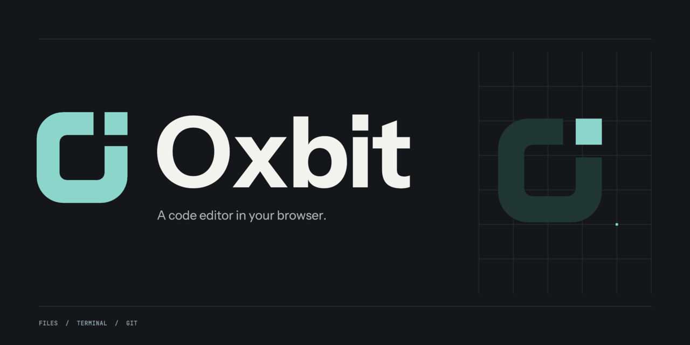

A web code editor built with React 19 and CodeMirror 6. Use a browser workspace
on its own, or connect the Node runtime for real files, managed language
services, terminals, tasks, Git, and collaboration.

## Quick start

Install **Node 24**, **pnpm 9.15**, **Git**, and **ripgrep** (`rg`). PTY builds
also need Python, make, and a C++ compiler when a platform prebuild is absent.

From the repository root:

```sh
pnpm install --frozen-lockfile
pnpm install:global
```

That builds the workspace and puts `oxbit` on your `PATH`:

```sh
oxbit                     # open the current directory
oxbit ~/code/my-project   # open a directory
oxbit src/main.ts         # open the current directory with that file focused
```

`oxbit` starts a runtime for the workspace, opens the paired editor in your
browser, and returns to the shell. A workspace already being served is reused,
so running `oxbit` again in the same project reopens the same runtime. Then:

1. Select **Trust workspace tools** in **Runtime connection** to enable terminals, tasks, Git, and language services.
2. Use the command palette (`Ctrl+Shift+P`, or `Cmd+Shift+P` on macOS) to find actions.

`pnpm install:global` links the checkout rather than copying it, so `oxbit` follows
the repository in place. Rerun `pnpm build` after pulling; `npm uninstall -g oxbit`
removes the command.

| Command            | Effect                                                                                 |
| ------------------ | -------------------------------------------------------------------------------------- |
| `oxbit --status`    | Report the runtime serving the workspace                                               |
| `oxbit --stop`      | Stop it                                                                                |
| `oxbit -f`          | Serve in the terminal and stay attached                                                |
| `oxbit --no-open`   | Leave the browser closed                                                               |
| `oxbit --port 9300` | Serve on a chosen port; applies when starting, so `--stop` first to move a running one |
| `oxbit --help`      | Full usage                                                                             |

The first workspace takes port **9277**; later ones take a free port, recorded in
`~/.oxbit/workspaces/<id>/daemon.json` alongside the log. The URL `oxbit` prints
carries the owner pairing code and the file to focus in its fragment; both are
consumed on load and removed from the address bar. Opening
**http://127.0.0.1:9277** without the fragment starts the `orbit-dash` sample
workspace in IndexedDB instead; pair from **Runtime connection** with the printed
code to reach the runtime's project.

Without a global install, `OXBIT_WORKSPACE=/absolute/path pnpm start` serves the
same runtime in the foreground. The default host is loopback;
[runtime configuration](docs/runtime.md) covers ports, allowed origins, state
storage, and network hosting.

## Desktop

A Tauri desktop host shares the existing editor and bundles Node, ripgrep, PTY,
and managed language services. Targets are Apple Silicon macOS 26+ and **Ubuntu
24.04+ x64**. Run `pnpm desktop:dev` or build local installers with
`pnpm desktop:build`. The existing CLI keeps its browser behavior;
`oxbit --desktop [path]` opens an installed desktop app.

[Desktop setup, release, and recovery](docs/desktop.md) documents native
dependencies, project windows, signing, updates, and commands.
[Desktop acceptance](evidence/desktop-acceptance.md) separates verified local
behavior from outstanding installed-artifact and signing gates.

## Workspaces and editing

- **Browser workspace:** files, settings, layout, and recovery drafts persist in
  IndexedDB. Use **Open Workspace** to import or export workspace JSON.
- **Open directory:** uses browser directory access when supported. A persisted
  browser workspace is the fallback. Reselect a directory if its permission expires.
- **Runtime filesystem:** reads and saves real files under the selected root.
  Saves check file revisions; external conflicts preserve local edits for resolution.

The editor supports JavaScript/TypeScript, web components, markup, shell,
configuration and data formats through a shared [language registry](docs/language-support.md).
[JSON settings](docs/settings.md) merge user preferences, private project overrides,
and optional `.config/oxbit/settings.json` / `settings.local.json` files.
It includes split views, multiple cursors, find/replace, formatter selection and
Markdown previews. Settings support user, workspace and language scopes.
Managed servers install pinned versions in a trusted runtime; local format
providers also work without one. The LSP indicator shows only providers for
the current document. See the [implementation and acceptance status](docs/language-support.md)
for feature coverage and remaining rollout gates.

MDX and the official Laravel LSP install automatically. JSON/JSONC files discover
and cache schemas from SchemaStore and document `$schema` references. Each runtime
project keeps editable settings and generated dependency/file intelligence in
`~/.oxbit/projects/<uuid>/`; open **Project Intelligence** from the command palette.
See [project intelligence and language setup](docs/project-intelligence.md).

Runtime features include PTY sessions, cancellable tasks, Git changes and
commits, clone/push/checkout, and authenticated Yjs collaboration. **Share
Workspace** creates revocable grants for another browser session. Grants and
workspace tool trust have separate controls. Trusted extensions and commands
execute with their host's privileges; see [trust and security](docs/security.md).

Unsaved drafts survive refresh and connection loss. Reconnect merges shared
edits and reattaches surviving terminals. After runtime process loss, old
terminals are shown as ended. Uncertain commands and commits are not repeated
automatically. See [persistence and recovery](docs/persistence.md).

## Development

Run these in separate terminals from the repository root:

```sh
# Runtime, with access from the Vite development origin
OXBIT_WORKSPACE=/absolute/path/to/your/project \
OXBIT_ORIGINS=http://localhost:9279,http://127.0.0.1:9279 pnpm dev
```

```sh
# React application with hot reload
pnpm dev:web
```

Open **http://localhost:9279** and pair with runtime URL
**http://127.0.0.1:9277**. On systems that exhaust filesystem watchers, start
the runtime with `OXBIT_WATCH_POLLING=1`. A production build is the fallback
when development process watching also fails.

| Location                                             | Responsibility                                   |
| ---------------------------------------------------- | ------------------------------------------------ |
| `apps/web`, `apps/runtime`                           | Browser entry point and authorized Node services |
| `packages/core`, `packages/sdk`, `packages/protocol` | Coordination, public contracts, runtime messages |
| `packages/documents`, `packages/host-*`              | Shared documents, persistence, host adapters     |
| `packages/ui`, `packages/workbench`                  | Components, layout, contribution surfaces        |
| `packages/features/*`                                | Independently registered editor features         |
| `examples/bundle-inspector`                          | External SDK extension example                   |

## Source Control

Source Control includes per-hunk staging, commit history and file diffs, branch
and remote management, pull/publish, stashes, and merge recovery. Open its
**Changes**, **History**, **Branches**, and **Stashes** tabs in a trusted runtime
workspace. See [Source Control](docs/source-control.md) for workflows and limits.

## Extensions

**Agent ACP** adds Codex ACP, Cursor ACP, and Amp Agent ACP with resumable
conversation history, inspectable editor context, chronological tool activity,
diff review in the editor, guarded undo, and permission controls. It is
**disabled by default**. Enable it in Extensions, connect to a trusted runtime,
and choose an agent. See [Agent ACP setup and tooling](docs/agent-acp.md).

Bundle Inspector contributes a command, panel, setting, status item, output
channel, and custom document view through the public SDK.

```sh
pnpm build:example
```

This builds `examples/bundle-inspector/dist/bundle-inspector.js` and copies it
to the browser's public extension directory. In **Extensions**, remove the
existing Bundle Inspector registration, then install
`/extensions/bundle-inspector.js`. Disable it to remove its contributions and
release its resources. The production build permits same-origin artifacts;
Vite supports development sources. See [the SDK reference](docs/sdk.md) for
manifests, activation, contributions, updates, and disposal.

## Verification

After installing dependencies, install the browser used by the test suite:

```sh
pnpm exec playwright install chromium
pnpm check
```

`pnpm check` runs lint, TypeScript checks, unit/integration tests, production
builds, and browser journeys. Run a part with `pnpm lint`, `pnpm typecheck`,
`pnpm test`, `pnpm build`, or `pnpm test:browser`. Browser journeys require a
production build and use port 9278 plus isolated temporary workspaces. Tests
run real processes and create Git repositories and commits.

The recorded desktop integration run passed 202 unit/integration tests and 44 browser journeys. See [desktop acceptance](evidence/desktop-acceptance.md) for native checks, build snapshots, and distribution limits.
Native directory recovery now passes after a browser refresh.
[Remaining gap](PHASE-2_REMAINING_GAP.md) records the earlier failure, the
Chromium 153 crash behind it, and the Playwright pin that closes it.

[Acceptance evidence](evidence/acceptance.md) records results, screenshots,
performance measurements, and checks that were not run.
[Feature status](docs/feature-status.md) separates implemented features,
verification limits, and deferred work.

## Design and technical references

The original Phase 1 ZIP is preserved under `design/reference/`, including
its HTML and supplied screenshots. Open `Oxbit Workbench.dc.html` for the
original mockup. `design/baselines/` adds full-size captures at all four
reference dimensions in both themes.

- [Original Phase 2 requirements](PHASE-2_FULL_IMPLEMENTATION.md) and [audit changes](docs/phase-2-audit.md)
- [Architecture and future host compatibility](docs/architecture.md)
- [Design screens, commands, settings, and ownership](docs/feature-map.md)
- [Dependency versions and compatibility](docs/dependencies.md)
- [Language-server contracts](docs/language.md)

React Native integration, certified Paseo 0.7.0 support,
a public marketplace, and further debugging/AI providers remain deferred.

## License

[MIT](LICENSE). Copyright © 2026 **Ryan Yannelli**
([yannelli](https://github.com/yannelli), <ryanyannelli@gmail.com>).
Bundled fonts and dependencies keep their [third-party licenses](THIRD_PARTY_NOTICES.md).

## Remote workspaces

Use **Connect over SSH…** in the desktop app to open a folder or file on Linux x64 or macOS Apple Silicon. Oxbit automatically installs a headless runtime through SSH and runs file operations, terminals, Git, search, and language services on the remote host. The host needs no Node/npm installation or outbound internet access for the bundled runtime. See [Remote SSH](docs/remote-ssh.md) for setup, supported systems, lifecycle, and verification.

### Tasks and services

The Tasks panel detects Paseo, VS Code, JetBrains, package scripts and other project commands; supports supervised services with dynamic ports, links, dependencies and worktree hooks; and saves to the detected source or a private project configuration. See [Tasks and lifecycle configuration](docs/tasks.md).
